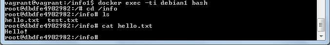

### Задача 1

Посмотрите на сценарий ниже и ответьте на вопрос: "Подходит ли в этом сценарии использование докера? Или лучше подойдет виртуальная машина, физическая машина? Или возможны разные варианты?"

Детально опишите и обоснуйте свой выбор.

--

Сценарий:

* Высоконагруженное монолитное java веб-приложение - **_так как высоконагруженное, то лучше на физической машине, но если несколько инстансов нужно - то лучше на виртуальной_**;
* Go-микросервис для генерации отчетов -  **_микросервис удобнее в докере_**;
* Nodejs веб-приложение - **_тоже можно просто докером запустить_**;
* Мобильное приложение c версиями для Android и iOS - **_докер_**;
* База данных postgresql используемая, как кэш - **_т.к. используется как кэш, то должна быстро работать, лучше разместить на физической машине_**;
* Шина данных на базе Apache Kafka - **_можно тоже докером развернуть_**;
* Очередь для Logstash на базе Redis - **_как я поняла про Logstash, читает сообщение и помещает его в Redis на хранение, т.е. бд можно в одном экземпляре развернуть и лучше на физической машине, чтоб быстрее выполнялись операции с БД._**;
* Elastic stack для реализации логирования продуктивного веб-приложения - три ноды elasticsearch, два logstash и две ноды kibana - **_лучше докером все развернуть, поскольку несколько связанных приложений и проще изменения накатывать_**;
* Мониторинг-стек на базе prometheus и grafana - **_можно докером развернуть_**;
* Mongodb, как основное хранилище данных для java-приложения - **_БД лучше на физической машине разворачивать_**;
* Jenkins-сервер - **_можно также докером развернуть_**.


Задача 2
Сценарий выполения задачи:

* создайте свой репозиторий на докерхаб;
* выберете любой образ, который содержит апачи веб-сервер;
* создайте свой форк образа;
* реализуйте функциональность: запуск веб-сервера в фоне с индекс-страницей, содержащей HTML-код ниже:
```
<html>
<head>
Hey, Netology
</head>
<body>
<h1>I’m kinda DevOps now</h1>
</body>
</html>
```
Опубликуйте созданный форк в своем репозитории и предоставьте ответ в виде ссылки на докерхаб-репо.

**_Ссылка на [докер-репо](https://hub.docker.com/r/anutkafluff/netology-httpd)_**

Задача 3
* Запустите первый контейнер из образа centos c любым тэгом в фоновом режиме, подключив папку info из текущей рабочей директории на хостовой машине в /share/info контейнера;
* второй контейнер из образа debian:latest в фоновом режиме, подключив папку info из текущей рабочей директории на хостовой машине в /info контейнера;
* Подключитесь к первому контейнеру с помощью exec и создайте текстовый файл любого содержания в /share/info ;
* Добавьте еще один файл в папку info на хостовой машине;
* Подключитесь во второй контейнер и отобразите листинг и содержание файлов в /info контейнера.

**_Листинг и содержание файлов в /info второго контейнера:_**


