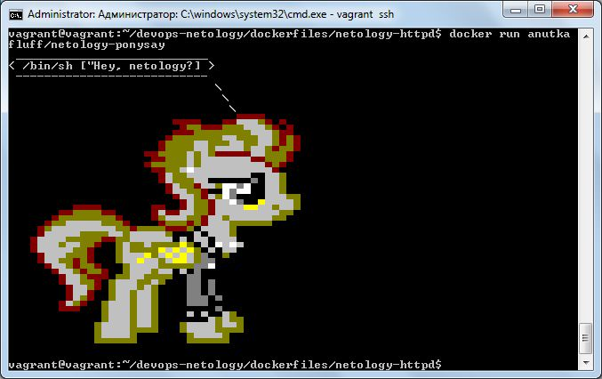

### Задача 1
В данном задании вы научитесь изменять существующие Dockerfile, адаптируя их под нужный инфраструктурный стек.

Измените базовый образ предложенного Dockerfile на Arch Linux c сохранением его функциональности.

```
FROM ubuntu:latest

RUN apt-get update && \
    apt-get install -y software-properties-common && \
    add-apt-repository ppa:vincent-c/ponysay && \
    apt-get update
 
RUN apt-get install -y ponysay

ENTRYPOINT ["/usr/bin/ponysay"]
CMD ["Hey, netology”]
```
Для получения зачета, вам необходимо предоставить:

* Написанный вами Dockerfile

**_Ссылка на [Dockerfile](https://github.com/anna-maksimovna/devops-netology/tree/main/dockerfiles/netology-ponysay)_**

* Скриншот вывода командной строки после запуска контейнера из вашего базового образа



* Ссылку на образ в вашем хранилище docker-hub

**_Ссылка на [докер-репо](https://hub.docker.com/r/anutkafluff/netology-ponysay)_**