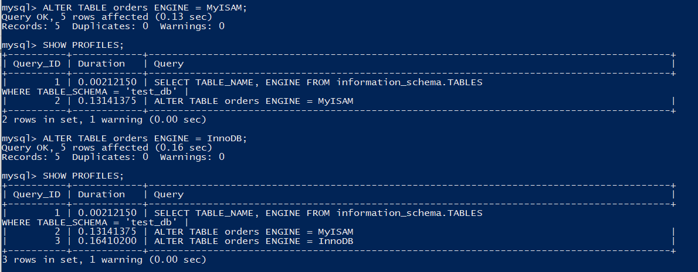
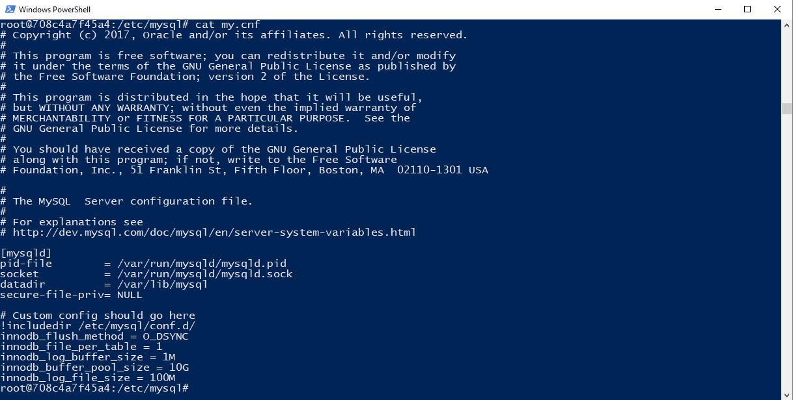

### Задача 1
Используя docker поднимите инстанс MySQL (версию 8). Данные БД сохраните в volume.

Изучите бэкап БД и восстановитесь из него.

Перейдите в управляющую консоль mysql внутри контейнера.

Используя команду \h получите список управляющих команд.

Найдите команду для выдачи статуса БД и приведите в ответе из ее вывода версию сервера БД.


```
Server version: 8.0.28 MySQL Community Server - GPL
```

Подключитесь к восстановленной БД и получите список таблиц из этой БД.


Приведите в ответе количество записей с price > 300.


В следующих заданиях мы будем продолжать работу с данным контейнером.

### Задача 2
Создайте пользователя test в БД c паролем test-pass, используя:

* плагин авторизации mysql_native_password
* срок истечения пароля - 180 дней
* количество попыток авторизации - 3
* максимальное количество запросов в час - 100
* аттрибуты пользователя:
Фамилия "Pretty"
Имя "James"
* Предоставьте привелегии пользователю test на операции SELECT базы test_db.

Используя таблицу INFORMATION_SCHEMA.USER_ATTRIBUTES получите данные по пользователю test и приведите в ответе к задаче.


### Задача 3
Установите профилирование SET profiling = 1. Изучите вывод профилирования команд SHOW PROFILES;.

Исследуйте, какой engine используется в таблице БД test_db и приведите в ответе.


Измените engine и приведите время выполнения и запрос на изменения из профайлера в ответе:

на MyISAM
на InnoDB



### Задача 4
Изучите файл my.cnf в директории /etc/mysql.

Измените его согласно ТЗ (движок InnoDB):

* Скорость IO важнее сохранности данных
* Нужна компрессия таблиц для экономии места на диске
* Размер буффера с незакомиченными транзакциями 1 Мб
* Буффер кеширования 30% от ОЗУ
* Размер файла логов операций 100 Мб
* Приведите в ответе измененный файл my.cnf.

