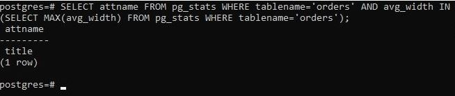

### Задача 1
Используя docker поднимите инстанс PostgreSQL (версию 13). Данные БД сохраните в volume.

Подключитесь к БД PostgreSQL используя psql.

Воспользуйтесь командой \? для вывода подсказки по имеющимся в psql управляющим командам.

Найдите и приведите управляющие команды для:
### Ответ:
* вывода списка БД
```
\l[+]
```
* подключения к БД
 ```
\c[onnect] {[DBNAME|- USER|- HOST|- PORT|-] | conninfo}
```
* вывода списка таблиц
```
\d[S+] NAME
```
* вывода описания содержимого таблиц
```
\dt[S+]
```
* выхода из psql
```
\q
```
### Задача 2
Используя psql создайте БД test_database.

Изучите бэкап БД.

Восстановите бэкап БД в test_database.

Перейдите в управляющую консоль psql внутри контейнера.

Подключитесь к восстановленной БД и проведите операцию ANALYZE для сбора статистики по таблице.

Используя таблицу pg_stats, найдите столбец таблицы orders с наибольшим средним значением размера элементов в байтах.

Приведите в ответе команду, которую вы использовали для вычисления и полученный результат.

**_Команда и результат:_**



### Задача 3
Архитектор и администратор БД выяснили, что ваша таблица orders разрослась до невиданных размеров и поиск по ней занимает долгое время. Вам, как успешному выпускнику курсов DevOps в нетологии предложили провести разбиение таблицы на 2 (шардировать на orders_1 - price>499 и orders_2 - price<=499).

Предложите SQL-транзакцию для проведения данной операции.

Можно ли было изначально исключить "ручное" разбиение при проектировании таблицы orders?

### Ответ:

SQL-транзакция для шардирования:
```
BEGIN;
CREATE TABLE orders_1 (
CHECK(price>499)
) INHERITS(orders);
CREATE TABLE orders_2 (
CHECK(price<=499)
) INHERITS(orders);
 
CREATE RULE orders_insert_to_1 AS ON INSERT TO orders
WHERE  (price>499)
DO INSTEAD INSERT INTO orders_1 VALUES (NEW.*);
 
CREATE RULE orders_insert_to_2 AS ON INSERT TO orders
WHERE  (price<=499)
DO INSTEAD INSERT INTO orders_2 VALUES (NEW.*);
COMMIT;

```

При проектировании можно сделать секционирование так:
```
CREATE TABLE orders (
    id integer NOT NULL,
    title character varying(80) NOT NULL,
    price integer DEFAULT 0
) PARTITION BY RANGE (price );
CREATE TABLE orders_1 PARTITION OF orders FOR VALUES FROM (499) TO (MAXVALUE);
CREATE TABLE orders_2 PARTITION OF orders FOR VALUES FROM
(MINVALUE) TO (499);

```

### Задача 4
Используя утилиту pg_dump создайте бекап БД test_database.

Как бы вы доработали бэкап-файл, чтобы добавить уникальность значения столбца title для таблиц test_database?

### Ответ:
Уникальность можно добавить так:
```
CREATE TABLE public.orders (
    id integer NOT NULL,
    title character varying(80) NOT NULL,
    price integer DEFAULT 0,
    UNIQUE(title)
);
```