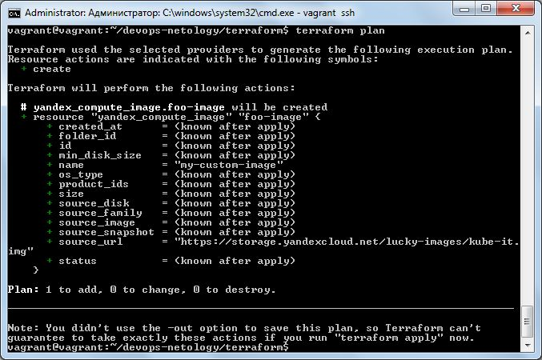

#### Задача 1 (Вариант с Yandex.Cloud). Регистрация в aws и знакомство с основами (необязательно, но крайне желательно).

#### Задача 2. Созданием aws ec2 или yandex_compute_instance через терраформ.

В качестве результата задания предоставьте:

1. Ответ на вопрос: при помощи какого инструмента (из разобранных на прошлом занятии) можно создать свой образ ami?
2. Ссылку на репозиторий с исходной конфигурацией терраформа.

### Ответы:
Делала для Yandex Cloud
1. Packer
2. Ссылка на [файлы конфигурации](https://github.com/anna-maksimovna/devops-netology/tree/main/terraform)
