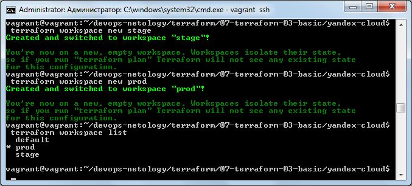
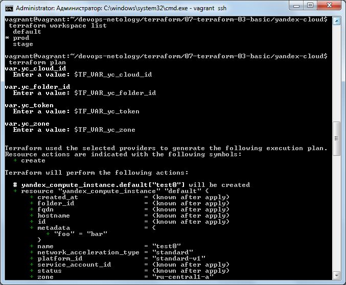
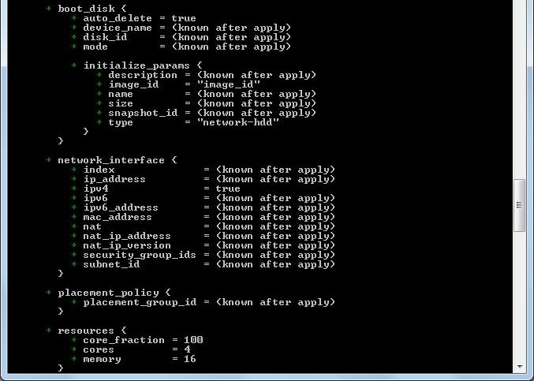
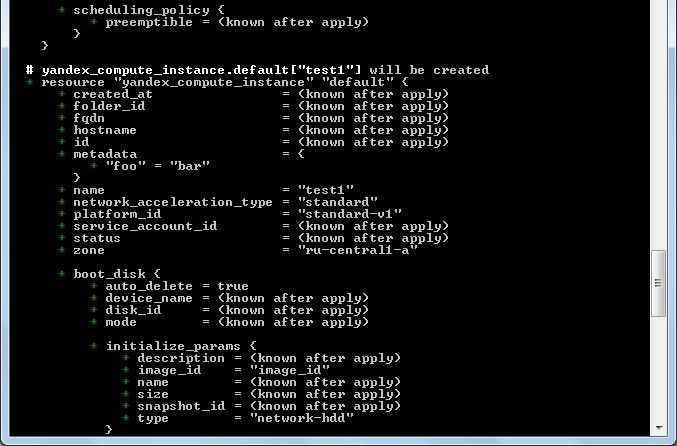
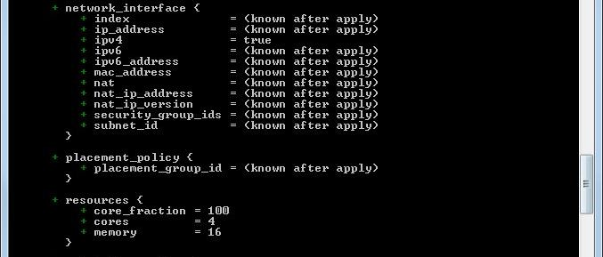
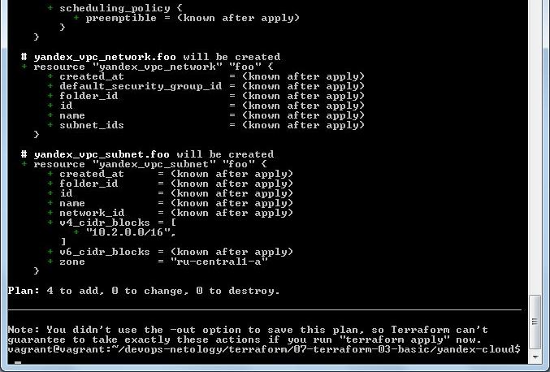

#### Задача 1. Создадим бэкэнд в S3 (необязательно, но крайне желательно).
##### Ответ
Не делала

#### Задача 2. Инициализируем проект и создаем воркспейсы.
1. Выполните terraform init:
   * если был создан бэкэнд в S3, то терраформ создат файл стейтов в S3 и запись в таблице dynamodb.
   * иначе будет создан локальный файл со стейтами.
2. Создайте два воркспейса stage и prod.
3. В уже созданный aws_instance добавьте зависимость типа инстанса от вокспейса, что бы в разных ворскспейсах использовались разные instance_type.
4. Добавим count. Для stage должен создаться один экземпляр ec2, а для prod два.
5. Создайте рядом еще один aws_instance, но теперь определите их количество при помощи for_each, а не count.
6. Что бы при изменении типа инстанса не возникло ситуации, когда не будет ни одного инстанса добавьте параметр жизненного цикла create_before_destroy = true в один из рессурсов aws_instance.
7. При желании поэкспериментируйте с другими параметрами и рессурсами.
В виде результата работы пришлите:

* Вывод команды terraform workspace list.
* Вывод команды terraform plan для воркспейса prod.

##### Ответ

Почему-то задание только для амазон описано, хотя для ЯОблака тоже можно делать.
В общем вот пример [конфигурации для амазона](https://github.com/anna-maksimovna/devops-netology/blob/main/terraform/07-terraform-03-basic/aws/main.tf)

Но тестила все на ЯОблаке и сделала [конфигурацию](https://github.com/anna-maksimovna/devops-netology/blob/main/terraform/07-terraform-03-basic/yandex-cloud/main.tf) с применением воркспейсов и цикла, для нее и запускала terraform plan:
* Вывод команды terraform workspace list.
  

* Вывод команды terraform plan для воркспейса prod.

