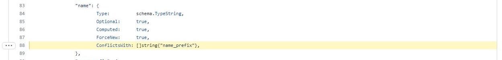
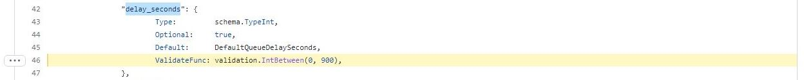

#### Задача 1
Давайте потренируемся читать исходный код AWS провайдера, который можно склонировать от сюда: https://github.com/hashicorp/terraform-provider-aws.git. Просто найдите нужные ресурсы в исходном коде и ответы на вопросы станут понятны.

1. Найдите, где перечислены все доступные resource и data_source, приложите ссылку на эти строки в коде на гитхабе.
2. Для создания очереди сообщений SQS используется ресурс aws_sqs_queue у которого есть параметр name.
    * С каким другим параметром конфликтует name? Приложите строчку кода, в которой это указано.
    * Какая максимальная длина имени?
    * Какому регулярному выражению должно подчиняться имя?

### Ответы:
1. Все доступные resource и data_source перечислены в файле [provider.go](https://github.com/hashicorp/terraform-provider-aws/blob/main/internal/provider/provider.go)
   
   [Resource](https://github.com/hashicorp/terraform-provider-aws/blob/main/internal/provider/provider.go#L737) строки 737-1760
   
   [Data_source](https://github.com/hashicorp/terraform-provider-aws/blob/main/internal/provider/provider.go#L344) строки 344-735
   

2. Для создания очереди сообщений SQS используется ресурс aws_sqs_queue, у которого есть параметр name.
    * Этот параметр конфликтует с параметром [name_prefix](https://github.com/hashicorp/terraform-provider-aws/blob/5902887f418edd969cff285acb35464a9c435c11/internal/service/sqs/queue.go#L88)
      
      
      
   * Максимальная длина имени и регулярное выражение не заданы.
   У некоторых других параметров заданы правила валидации, например, у delay_seconds:
     
     Минимальное значение - 0, максимальное значение - 900:
     
      