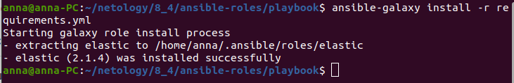
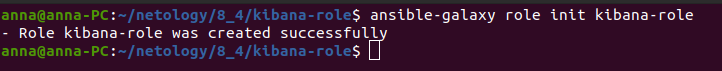
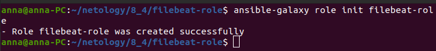
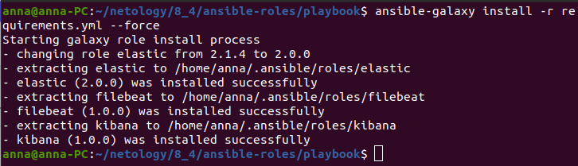

# Домашнее задание к занятию "8.4 Работа с Roles"

[Репозиторий с Playbook](https://github.com/anna-maksimovna/ansible-roles)

[Репозиторий с Kibana-role](https://github.com/anna-maksimovna/kibana-role)

[Репозиторий с Filebeat-role](https://github.com/anna-maksimovna/filebeat-role)

Т.к. предыдущее ДЗ у меня было сделано по предыдущей версии playbook, то это ДЗ делала также по предыдущей версии

> ### Подготовка к выполнению
> Создайте два пустых публичных репозитория в любом своём проекте: kibana-role и filebeat-role.
> Добавьте публичную часть своего ключа к своему профилю в github.
> ### Основная часть
>  Наша основная цель - разбить наш playbook на отдельные roles. Задача: сделать roles для elastic, kibana, filebeat и написать playbook для использования этих ролей. Ожидаемый результат: существуют два ваших репозитория с roles и один репозиторий с playbook.

> 1. Создать в старой версии playbook файл requirements.yml и заполнить его следующим содержимым:
> ---
>   - src: git@github.com:netology-code/mnt-homeworks-ansible.git
>     scm: git
>    version: "2.1.4"
>     name: elastic 

> 2. При помощи ansible-galaxy скачать себе эту роль.
> 3. Создать новый каталог с ролью при помощи ansible-galaxy role init kibana-role.

> 4. На основе tasks из старого playbook заполните новую role. Разнесите переменные между vars и default.
> 5. Перенести нужные шаблоны конфигов в templates.
> 6. Создать новый каталог с ролью при помощи ansible-galaxy role init filebeat-role.

> 7. На основе tasks из старого playbook заполните новую role. Разнесите переменные между vars и default.
> 8. Перенести нужные шаблоны конфигов в templates.
> 9. Описать в README.md обе роли и их параметры.
> 10. Выложите все roles в репозитории. Проставьте тэги, используя семантическую нумерацию.
> 11. Добавьте roles в requirements.yml в playbook.

> 12. Переработайте playbook на использование roles.
> 13. Выложите playbook в репозиторий.
> 14. В ответ приведите ссылки на оба репозитория с roles и одну ссылку на репозиторий с playbook.