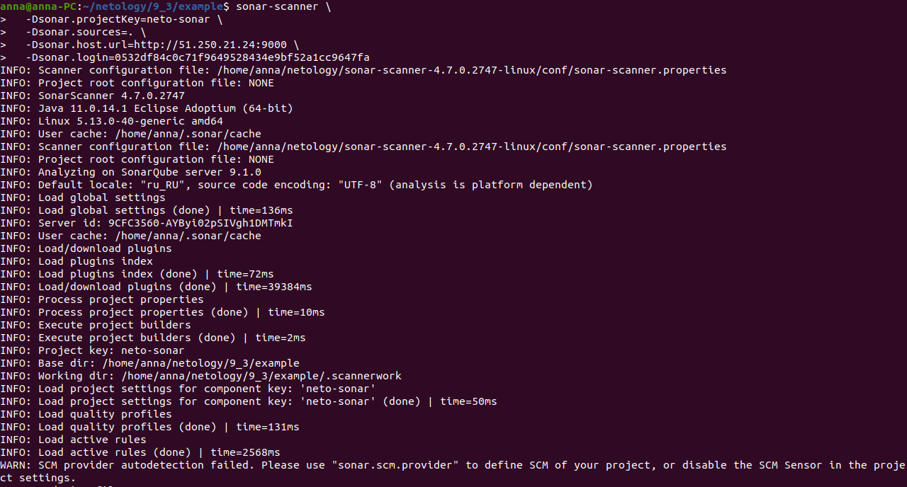
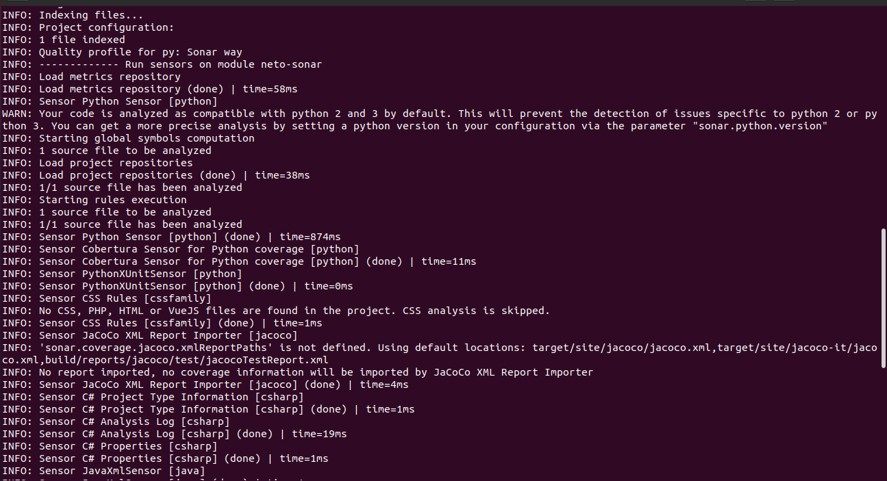
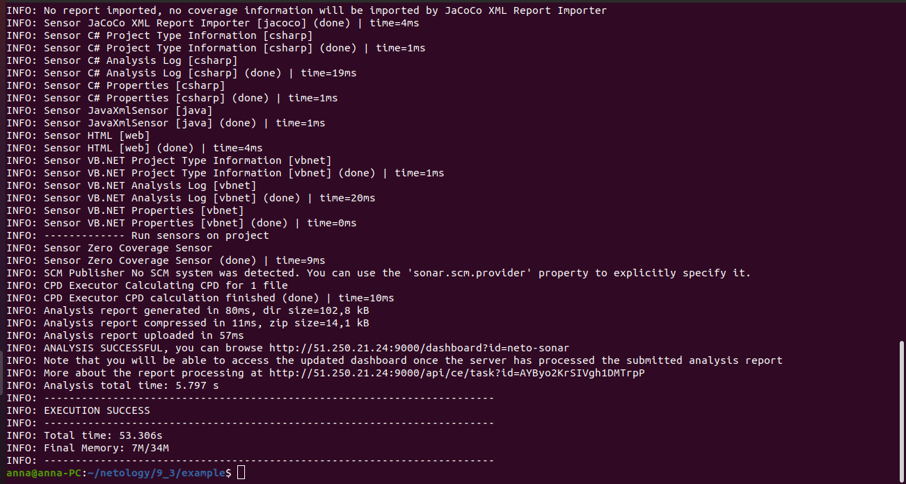
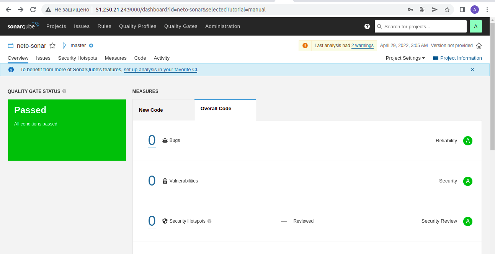

# Домашнее задание к занятию "09.03 CI\CD"

### Знакомоство с SonarQube

   
   
   
   
   
   
   

### Знакомство с Nexus

[maven-metadata.xml](https://github.com/anna-maksimovna/devops-netology/blob/main/09-ci-03-cicd/maven-metadata.xml)

### Знакомство с Maven

[Гитлаб репозиторий](https://github.com/anna-maksimovna/devops-netology/blob/main/09-ci-03-cicd/mvn/pom.xml)

> #### Подготовка к выполнению
> Создаём 2 VM в yandex cloud со следующими параметрами: 2CPU 4RAM Centos7(остальное по минимальным требованиям)
> Прописываем в inventory playbook'a созданные хосты
> Добавляем в files файл со своим публичным ключом (id_rsa.pub). Если ключ называется иначе - найдите таску в плейбуке, которая использует id_rsa.pub имя и исправьте на своё
> Запускаем playbook, ожидаем успешного завершения
> Проверяем готовность Sonarqube через браузер
> Заходим под admin\admin, меняем пароль на свой
> Проверяем готовность Nexus через бразуер
> Подключаемся под admin\admin123, меняем пароль, сохраняем анонимный доступ
> #### Знакомоство с SonarQube
> Основная часть
> Создаём новый проект, название произвольное
> Скачиваем пакет sonar-scanner, который нам предлагает скачать сам sonarqube
> Делаем так, чтобы binary был доступен через вызов в shell (или меняем переменную PATH или любой другой удобный вам способ)
> Проверяем sonar-scanner --version
> Запускаем анализатор против кода из директории example с дополнительным ключом -Dsonar.coverage.exclusions=fail.py
> Смотрим результат в интерфейсе
> Исправляем ошибки, которые он выявил(включая warnings)
> Запускаем анализатор повторно - проверяем, что QG пройдены успешно
> Делаем скриншот успешного прохождения анализа, прикладываем к решению ДЗ
> #### Знакомство с Nexus
> Основная часть
> В репозиторий maven-public загружаем артефакт с GAV параметрами:
> groupId: netology
> artifactId: java
> version: 8_282
> classifier: distrib
> type: tar.gz
> В него же загружаем такой же артефакт, но с version: 8_102
> Проверяем, что все файлы загрузились успешно
> В ответе присылаем файл maven-metadata.xml для этого артефекта
> #### Знакомство с Maven
> Подготовка к выполнению
> Скачиваем дистрибутив с maven
> Разархивируем, делаем так, чтобы binary был доступен через вызов в shell (или меняем переменную PATH или любой другой удобный вам способ)
> Удаляем из apache-maven-<version>/conf/settings.xml упоминание о правиле, отвергающем http соединение( раздел mirrors->id: my-repository-http-unblocker)
> Проверяем mvn --version
> Забираем директорию mvn с pom
> Основная часть
> Меняем в pom.xml блок с зависимостями под наш артефакт из первого пункта задания для Nexus (java с версией 8_282)
> Запускаем команду mvn package в директории с pom.xml, ожидаем успешного окончания
> Проверяем директорию ~/.m2/repository/, находим наш артефакт
> В ответе присылаем исправленный файл pom.xml
