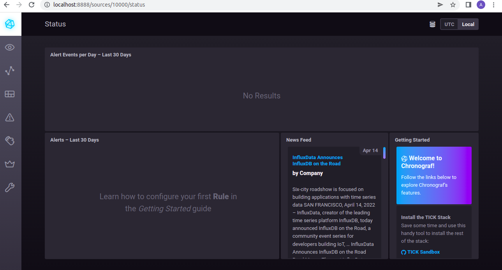

# Домашнее задание к занятию "10.02. Системы мониторинга"
### Обязательные задания

1. **Опишите основные плюсы и минусы pull и push систем мониторинга.**

Дополнительно к материалу из лекции:

* "+"Pull:Контроль подлинности и количества данных, поскольку сам сервер инициирует соединение

"-"Push:Можно ошибиться относительно того, откуда на самом деле пришли данные, т.к. используются временные соединения

* "+"Push:Можно настроить агент для отправки данных на несколько серверов, при этом все приемники получат одни и те же точные данные

"-"Pull:Тогда как если запустить два pull-сервера, то они, скорее всего, не будут иметь одинаковых точных данных.Как минимум, может быть разница во временной метке.

* "+"Pull: Ели будут проблемы при проверке метрик, то легко решить на сервере или на агенте проблемы

"-"Push:Тогда как в этой модели непонятно с чем связана проблема


2. **Какие из ниже перечисленных систем относятся к push модели,
 а какие к pull? А может есть гибридные?**
   
* Prometheus - по умолчанию Pull, но можно настроить и Push
* TICK - по умолчанию Push, но можно настроить и Pull
* Zabbix - Push/Pull
* VictoriaMetrics -Push/Pull
* Nagios - Pull

3. **Склонируйте себе репозиторий и запустите TICK-стэк, используя технологии
 docker и docker-compose.**
 
**В виде решения на это упражнение приведите выводы команд с вашего 
компьютера (виртуальной машины):**

```
- curl http://localhost:8086/ping
- curl http://localhost:8888
- curl http://localhost:9092/kapacitor/v1/ping
```


**А также скриншот веб-интерфейса ПО chronograf (http://localhost:8888).**

**P.S.: если при запуске некоторые контейнеры будут падать с ошибкой - проставьте им режим Z,
 например ./data:/var/lib:Z**
 

 
4. **Перейдите в веб-интерфейс Chronograf `http://localhost:8888)` и откройте вкладку `Data explorer`.**

* **Нажмите на кнопку `Add a query`**
* **Изучите вывод интерфейса и выберите БД `telegraf.autogen`**
* **В `measurments` выберите mem->host->telegraf_container_id , а в `fields` выберите `used_percent`.
 Внизу появится график утилизации оперативной памяти в контейнере telegraf.**
* **Вверху вы можете увидеть запрос, аналогичный SQL-синтаксису. Поэкспериментируйте с запросом,
 попробуйте изменить группировку и интервал наблюдений.**
   

  
  **Для выполнения задания приведите скриншот с отображением метрик утилизации места на диске
  (disk->host->telegraf_container_id) из веб-интерфейса.**
  


5. Изучите список telegraf inputs. Добавьте в конфигурацию telegraf следующий плагин - docker:

```
[[inputs.docker]]
  endpoint = "unix:///var/run/docker.sock"
```
**Дополнительно вам может потребоваться донастройка контейнера telegraf в docker-compose.yml дополнительного volume и режима privileged:**
```
telegraf:
    image: telegraf:1.4.0
    privileged: true
    volumes:
      - ./etc/telegraf.conf:/etc/telegraf/telegraf.conf:Z
      - /var/run/docker.sock:/var/run/docker.sock:Z
    links:
      - influxdb
    ports:
      - "8092:8092/udp"
      - "8094:8094"
      - "8125:8125/udp"
```
**После настройке перезапустите telegraf, обновите веб интерфейс и приведите скриншотом
 список measurments в веб-интерфейсе базы telegraf.autogen . 
 Там должны появиться метрики, связанные с docker.**

**Факультативно можете изучить какие метрики собирает telegraf после выполнения данного задания.**

