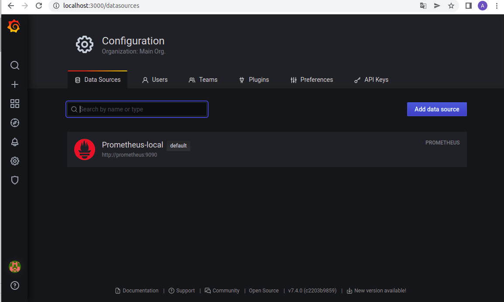
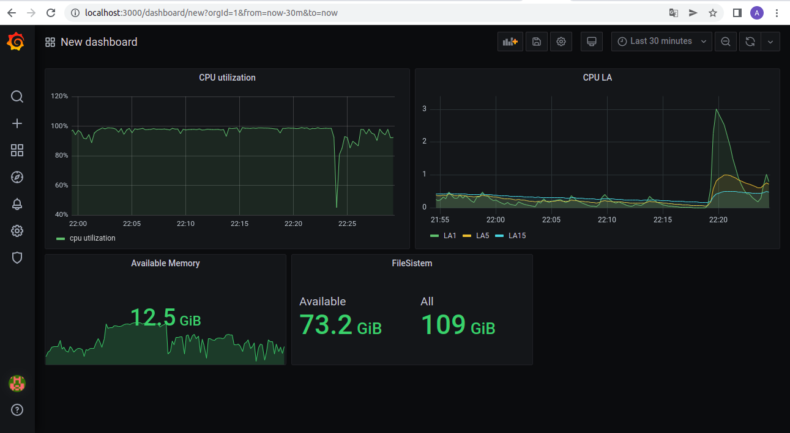
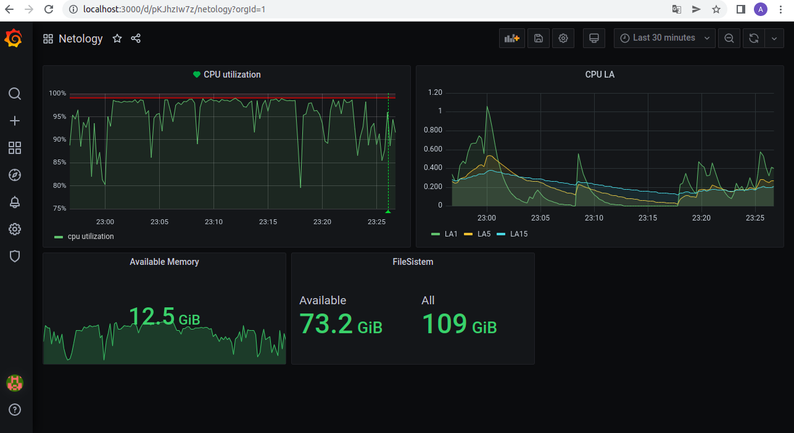

# Домашнее задание к занятию "10.03. Grafana"
### Задание 1
**Используя директорию help внутри данного домашнего задания - запустите связку prometheus-grafana.**

**Зайдите в веб-интерфейс графана, используя авторизационные данные, указанные в манифесте docker-compose.**

**Подключите поднятый вами prometheus как источник данных.**

**Решение домашнего задания - скриншот веб-интерфейса grafana со списком подключенных Datasource.**

### Задание 2
   
**Изучите самостоятельно ресурсы:**

**promql-for-humans**
**understanding prometheus cpu metrics**
**Создайте Dashboard и в ней создайте следующие Panels:**

* **Утилизация CPU для nodeexporter (в процентах, 100-idle)**

(avg by (instance)(irate(node_cpu_seconds_total{instance="nodeexporter:9100", mode="idle"}[1m]))*100)

* **CPULA 1/5/15**

node_load1{instance="nodeexporter:9100",job="nodeexporter"}

node_load5{instance="nodeexporter:9100",job="nodeexporter"}

node_load15{instance="nodeexporter:9100",job="nodeexporter"}

* **Количество свободной оперативной памяти**

node_memory_MemAvailable_bytes{instance="nodeexporter:9100",job="nodeexporter"}

* **Количество места на файловой системе**

node_filesystem_avail_bytes{instance="nodeexporter:9100",fstype="ext4"}

node_filesystem_size_bytes{instance="nodeexporter:9100",fstype="ext4"}

**Для решения данного ДЗ приведите promql запросы для выдачи этих метрик, а также скриншот получившейся Dashboard.**

### Задание 3
 
**Создайте для каждой Dashboard подходящее правило alert (можно обратиться к первой лекции в блоке "Мониторинг").Для решения ДЗ - приведите скриншот вашей итоговой Dashboard.**

В моем дашборде только у одной панели была доступна вкладка alert, поэтому добавила только один.

 
### Задание 4
   
**Сохраните ваш Dashboard.**

**Для этого перейдите в настройки Dashboard, выберите в боковом меню "JSON MODEL".**

**Далее скопируйте отображаемое json-содержимое в отдельный файл и сохраните его.**

**В решении задания - приведите листинг этого файла.**

 [Dashboard](https://github.com/anna-maksimovna/devops-netology/blob/main/10-monitoring-03-grafana/dashboard.json)
