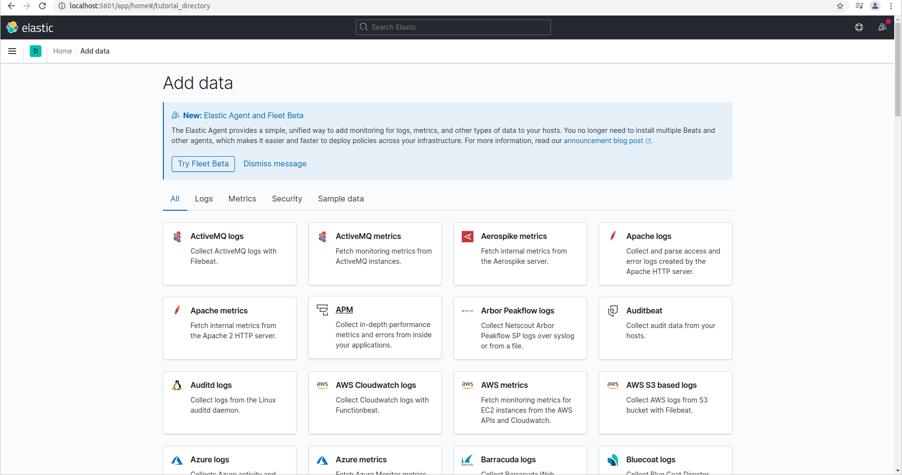
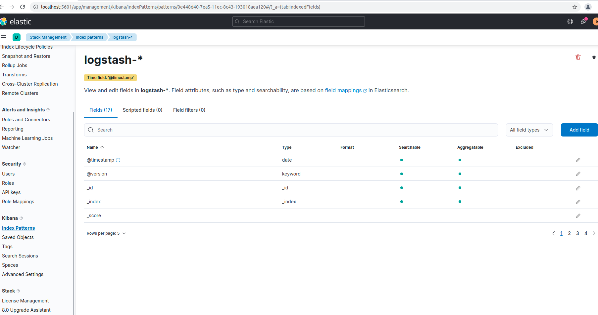
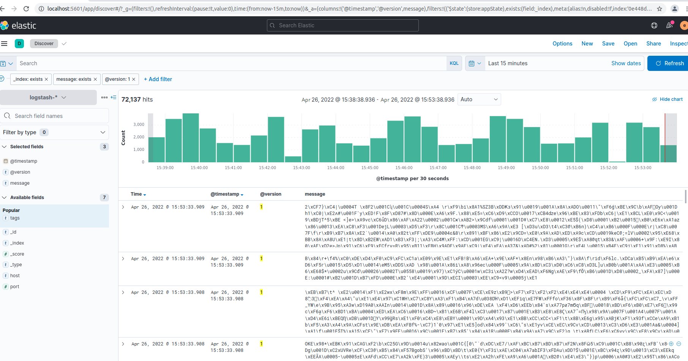

# Домашнее задание к занятию "10.04. ELK"
### Задание 1
**Вам необходимо поднять в докере:**
**elasticsearch(hot и warm ноды), logstash, kibana, filebeat и связать их между собой.**

**Logstash следует сконфигурировать для приёма по tcp json сообщений.**

**Filebeat следует сконфигурировать для отправки логов docker вашей системы в logstash.**

**В директории help находится манифест docker-compose и конфигурации filebeat/logstash для быстрого выполнения данного задания.**

**Результатом выполнения данного задания должны быть:**

* **скриншот docker ps через 5 минут после старта всех контейнеров (их должно быть 5)**
* скриншот интерфейса kibana**
* docker-compose манифест (если вы не использовали директорию help)**
* ваши yml конфигурации для стека (если вы не использовали директорию help)**

Директория help вообще нерабочая, нашла более менее рабочую версию, но сейчас вообще сложно что либо найти, потому что многие образы эластика и т.д. недоступны в связи с ситуацией в мире((

### Задание 2
   
**Перейдите в меню создания index-patterns в kibana и создайте несколько index-patterns из имеющихся.**

**Перейдите в меню просмотра логов в kibana (Discover) и самостоятельно изучите как отображаются логи и как производить поиск по логам.**

**В манифесте директории help также приведенно dummy приложение, которое генерирует рандомные события в stdout контейнера. Данные логи должны порождать индекс logstash-* в elasticsearch. Если данного индекса нет - воспользуйтесь советами и источниками из раздела "Дополнительные ссылки" данного ДЗ.**

