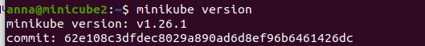
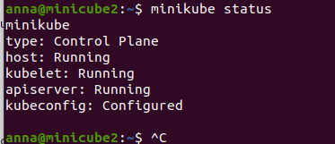
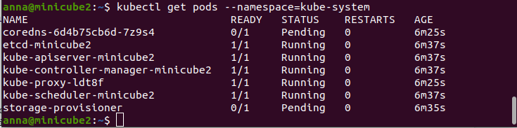
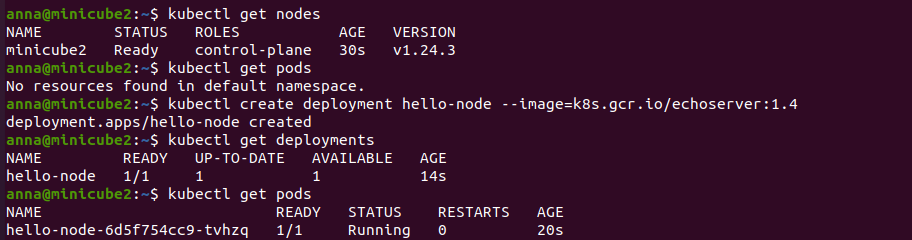
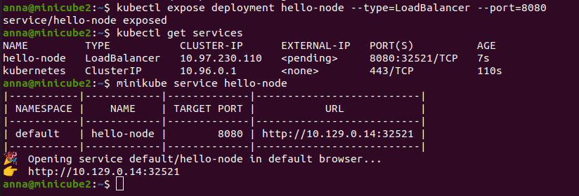
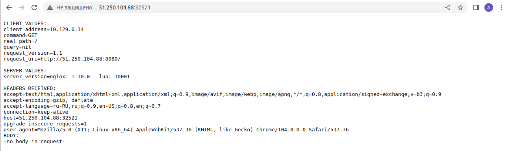
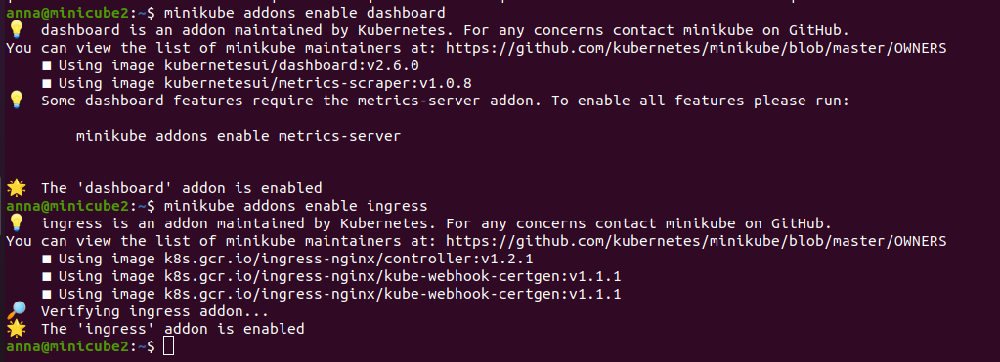
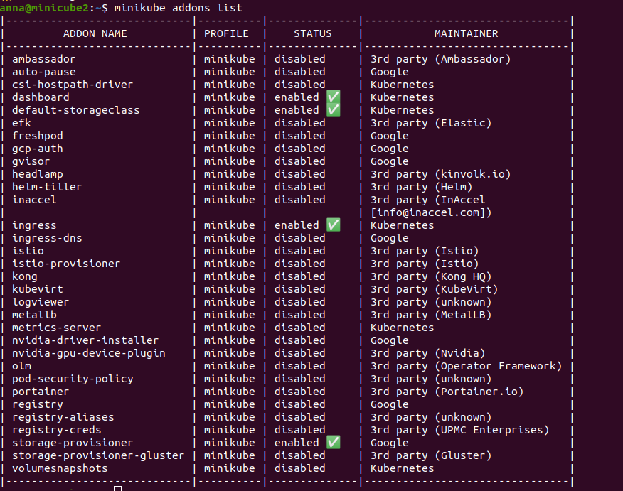
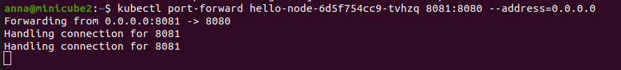
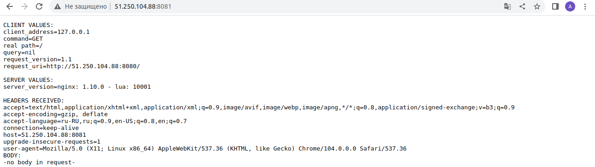

# Домашнее задание к занятию "12.1 Компоненты Kubernetes"

Вы DevOps инженер в крупной компании с большим парком сервисов. Ваша задача — разворачивать эти продукты в корпоративном кластере.

### Задача 1: Установить Minikube

Для экспериментов и валидации ваших решений вам нужно подготовить тестовую среду для работы с Kubernetes. Оптимальное решение — развернуть на рабочей машине Minikube.

Как поставить на AWS:
* создать EC2 виртуальную машину (Ubuntu Server 20.04 LTS (HVM), SSD Volume Type) с типом t3.small. Для работы потребуется настроить Security Group для доступа по ssh. Не забудьте указать keypair, он потребуется для подключения.
* подключитесь к серверу по ssh (ssh ubuntu@<ipv4_public_ip> -i .pem)
* установите миникуб и докер следующими командами:
> curl -LO https://storage.googleapis.com/kubernetes-release/release/`curl -s https://storage.googleapis.com/kubernetes-release/release/stable.txt`/bin/linux/amd64/kubectl
> chmod +x ./kubectl
> sudo mv ./kubectl /usr/local/bin/kubectl
> sudo apt-get update && sudo apt-get install docker.io conntrack -y
> curl -Lo minikube https://storage.googleapis.com/minikube/releases/latest/minikube-linux-amd64 && chmod +x minikube && sudo mv minikube /usr/local/bin/
* проверить версию можно командой minikube version
* переключаемся на root и запускаем миникуб: minikube start --vm-driver=none
* после запуска стоит проверить статус: minikube status
* запущенные служебные компоненты можно увидеть командой: kubectl get pods --namespace=kube-system

Для сброса кластера стоит удалить кластер и создать заново:

> minikube delete
> minikube start --vm-driver=none

Возможно, для повторного запуска потребуется выполнить команду: sudo sysctl fs.protected_regular=0

Инструкция по установке Minikube - ссылка

Важно: t3.small не входит во free tier, следите за бюджетом аккаунта и удаляйте виртуалку.

## Решение:

Устанавливала все на виртуальной машине в Yandex Cloud.

Выполнила команды:

> curl -LO https://storage.googleapis.com/kubernetes-release/release/`curl -s https://storage.googleapis.com/kubernetes-release/release/stable.txt`/bin/linux/amd64/kubectl
> chmod +x ./kubectl
> sudo mv ./kubectl /usr/local/bin/kubectl
> sudo apt-get update && sudo apt-get install docker.io conntrack -y
> curl -Lo minikube https://storage.googleapis.com/minikube/releases/latest/minikube-linux-amd64 && chmod +x minikube && sudo mv minikube /usr/local/bin/

> minikube version
> minikube start --vm-driver=none

Нормально не стартовало, были ошибки. Исправляла следующим образом:

> // установка golang для установки cri-dockerd
> // делала по ссылке https://tecadmin.net/how-to-install-go-on-ubuntu-20-04/
> sudo apt-get update  
> sudo apt-get -y upgrade 
> sudo wget https://go.dev/dl/go1.17.13.linux-amd64.tar.gz
> sudo tar -C /usr/local -xzf go1.17.13.linux-amd64.tar.gz
> export GOROOT=/usr/local/go
> export GOPATH=$HOME/Projects/Proj1
> export PATH=$GOPATH/bin:$GOROOT/bin:$PATH

> //установка cri-dockerd
> /*
> Для исправления ошибки:
> Exiting due to NOT_FOUND_CRI_DOCKERD: 
> ??  Suggestion: 
>     The none driver with Kubernetes v1.24+ and the docker container-runtime requires cri-dockerd.    
>     Please install cri-dockerd using these instructions:    
>     https://github.com/Mirantis/cri-dockerd#build-and-install
> */
> 
> git clone https://github.com/Mirantis/cri-dockerd.git
> cd cri-dockerd
> mkdir bin
> go build -o bin/cri-dockerd
> mkdir -p /usr/local/bin
> 
> sudo install -o root -g root -m 0755 bin/cri-dockerd /usr/local/bin/cri-dockerd
> sudo cp -a packaging/systemd/* /etc/systemd/system
> sudo sed -i -e 's,/usr/bin/cri-dockerd,/usr/local/bin/cri-dockerd,' /etc/systemd/system/cri-docker.service
> sudo systemctl daemon-reload
> sudo systemctl enable cri-docker.service
> sudo systemctl enable --now cri-docker.socket

> //установка crictl
> //Для исправления ошибки:
> // sudo: crictl: command not found
> 
> VERSION="v1.24.2"
> wget https://github.com/kubernetes-sigs/cri-tools/releases/download/$VERSION/crictl-$VERSION-linux-amd64.tar.gz
> sudo tar zxvf crictl-$VERSION-linux-amd64.tar.gz -C /usr/local/bin
> rm -f crictl-$VERSION-linux-amd64.tar.gz

> //для установки прав на докер
> //Для исправления ошибки
> /*Got permission denied while trying to connect to the Docker daemon socket at unix:///var/run/docker.sock: Get "http://%2Fvar%2Frun%2Fdocker.sock/v1.24/version": dial unix /var/run/docker.sock: connect: permission denied
> */
> 
> sudo chmod 666 /var/run/docker.sock

Далее продолжаем стартовать миникуб:
> minikube start --vm-driver=none
> minikube status
> kubectl get pods --namespace=kube-system

 
 
 
 
 

### Задача 2: Запуск Hello World

После установки Minikube требуется его проверить. Для этого подойдет стандартное приложение hello world. А для доступа к нему потребуется ingress.

* развернуть через Minikube тестовое приложение по туториалу
* установить аддоны ingress и dashboard

## Решение:

С первого раза не получилось развернуть:

> kubectl get nodes

оказалось, что node был в состоянии NotReady из-за того, что не установлен плагин сетевой cni

накатила сначала flannel, но с ним **НЕ** заработало:
> kubectl apply -f https://raw.githubusercontent.com/coreos/flannel/master/Documentation/kube-flannel.yml

**Сработало с calico:**

> curl https://docs.projectcalico.org/manifests/calico.yaml -O 
> kubectl apply -f calico.yaml

Далее все по туториулу, выполняла команды:
> kubectl get nodes
> kubectl create deployment hello-node --image=k8s.gcr.io/echoserver:1.4
> kubectl get deployments
> kubectl get pods

Все вышеперечисленные команды сказали, что все в статусе Ready:

> kubectl expose deployment hello-node --type=LoadBalancer --port=8080
> minikube service hello-node

Открыла в браузере http://51.250.104.88:32521/ - отобразилась страничка.

Установила аддоны:

> minikube addons enable ingress
> minikube addons enable dashboard
> minikube addons list

### Задача 3: Установить kubectl

Подготовить рабочую машину для управления корпоративным кластером. Установить клиентское приложение kubectl.

* подключиться к minikube
* проверить работу приложения из задания 2, запустив port-forward до кластера

## Решение:

Сразу тоже не получилось. Выполнила команду:

> sudo apt-get -y install socat

Затем запустила port-forward:

> kubectl port-forward hello-node-6d5f754cc9-wj2xp 8081:8080 –address=0.0.0.0

Результат:

