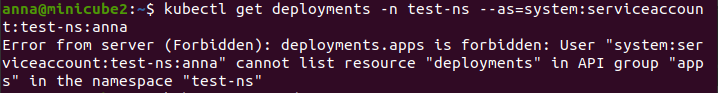

# Домашнее задание к занятию "12.2 Команды для работы с Kubernetes"

Кластер — это сложная система, с которой крайне редко работает один человек. Квалифицированный devops умеет наладить работу всей команды, занимающейся каким-либо сервисом. После знакомства с кластером вас попросили выдать доступ нескольким разработчикам. Помимо этого требуется служебный аккаунт для просмотра логов.

### Задание 1: Запуск пода из образа в деплойменте

Для начала следует разобраться с прямым запуском приложений из консоли. Такой подход поможет быстро развернуть инструменты отладки в кластере. Требуется запустить деплоймент на основе образа из hello world уже через deployment. Сразу стоит запустить 2 копии приложения (replicas=2).

Требования:

* пример из hello world запущен в качестве deployment
* количество реплик в deployment установлено в 2
* наличие deployment можно проверить командой kubectl get deployment
* наличие подов можно проверить командой kubectl get pods

## Решение:
```
kubectl create namespace test-ns
kubectl create deployment hello-node-dep -n test-ns --image=k8s.gcr.io/echoserver:1.4 --replicas=2
```

Результат:
```
kubectl get deployments -n test-ns
kubectl get pods -n test-ns
```

 


### Задание 2: Просмотр логов для разработки

Разработчикам крайне важно получать обратную связь от штатно работающего приложения и, еще важнее, об ошибках в его работе. Требуется создать пользователя и выдать ему доступ на чтение конфигурации и логов подов в app-namespace.

Требования:

* создан новый токен доступа для пользователя
* пользователь прописан в локальный конфиг (~/.kube/config, блок users)
* пользователь может просматривать логи подов и их конфигурацию (kubectl logs pod <pod_id>, kubectl describe pod <pod_id>)

## Решение:

Залила на виртуальную машину 3 файла для настройки юзера и его прав:

Создала описанные ресурсы:
```
kubectl apply -f serviceaccount.yaml -n test-ns
kubectl apply -f role.yaml -n test-ns
kubectl apply -f rolebinding.yaml -n test-ns
```

Конфиг:
```
cat ~/.kube/config
```


Проверка, что права есть:
```
kubectl get pods -n test-ns --as=system:serviceaccount:test-ns:anna
kubectl describe pods hello-node-dep-7d975f54ff-dsp92 -n test-ns --as=system:serviceaccount:test-ns:anna
kubectl logs hello-node-dep-7d975f54ff-dsp92 -n test-ns --as=system:serviceaccount:test-ns:anna
```


Проверка, что нет прав на другие действия:
```
kubectl get pods --as=system:serviceaccount:test-ns:anna
kubectl get deployments -n test-ns --as=system:serviceaccount:test-ns:anna
```




### Задание 3: Изменение количества реплик

Поработав с приложением, вы получили запрос на увеличение количества реплик приложения для нагрузки. Необходимо изменить запущенный deployment, увеличив количество реплик до 5. Посмотрите статус запущенных подов после увеличения реплик.

Требования:

* в deployment из задания 1 изменено количество реплик на 5
* проверить что все поды перешли в статус running (kubectl get pods)


## Решение:

Выполнила команду:

```
kubectl scale --replicas=5 deployment hello-node-dep -n test-ns
```

Результат:

```
kubectl get deployments -n test-ns
kubectl get pods -n test-ns
```

