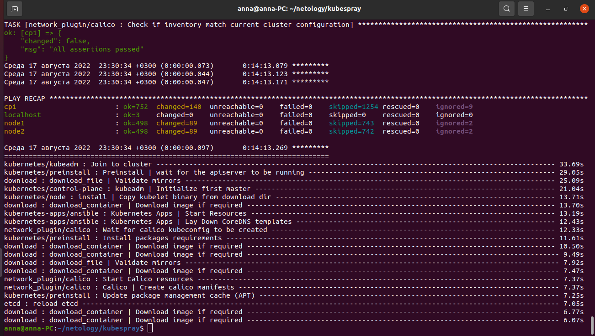

# Домашнее задание к занятию "12.4 Развертывание кластера на собственных серверах, лекция 2"

Новые проекты пошли стабильным потоком. Каждый проект требует себе несколько кластеров: под тесты и продуктив. Делать все руками — не вариант, поэтому стоит автоматизировать подготовку новых кластеров.

### Задание 1: Подготовить инвентарь kubespray

Новые тестовые кластеры требуют типичных простых настроек. Нужно подготовить инвентарь и проверить его работу. Требования к инвентарю:

* подготовка работы кластера из 5 нод: 1 мастер и 4 рабочие ноды;
* в качестве CRI — containerd;
* запуск etcd производить на мастере.

## Решение:

В лекции сказали, что можно 1 мастер-ноду и 2 рабочих ноды развернуть - делала так.
Для этого запустила 3 виртуальные машины на Yandex Cloud.

Скачиваем kubespray отсюда:
```
git clone https://github.com/kubernetes-sigs/kubespray
```

Копируем папку inventory/sample как  inventory/mycluster

В inventory/mycluster/group_vars/k8s_cluster/k8s-cluster.yml уже по умолчанию установлено:
```
container_manager: containerd
```
Выполняем:
```
cd kubespray
sudo pip3 install -r requirements.txt
```

```
# Обновление Ansible inventory с помощью билдера 
declare -a IPS=(51.250.29.0 84.252.143.68 51.250.110.181)
CONFIG_FILE=inventory/mycluster/hosts.yaml python3 contrib/inventory_builder/inventory.py ${IPS[@]}
```

Отредактировала hosts.yaml т.к. сгенерился какой-то странный, назвала ноды по другому и скомпановала так, чтобы была одна мастер-нода и 2 рабочих. 

Запускаем развертывание кластера:
```
ansible-playbook -i inventory/mycluster/hosts.yaml  --become --become-user=root cluster.yml
```

В целом установка прошла успешно, было пару перезапусков из-за того что редактировала hosts.yaml и были косячки с ip адресами.



После установки зашла на мастер-ноду для проверки:
```
kubectl get nodes
```

Команда выдала ошибку:
```
The connection to the server localhost:8080 was refused - did you specify the right host or port?
```


Нашла решение:
```
mkdir -p $HOME/.kube
sudo cp -i /etc/kubernetes/admin.conf $HOME/.kube/config
sudo chown $(id -u):$(id -g) $HOME/.kube/config
```

Еще раз запустила команду и ноды в состоянии Ready:
```
kubectl get nodes
```


