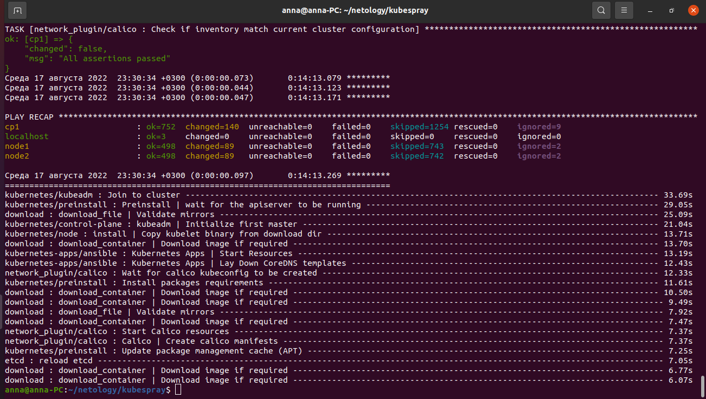
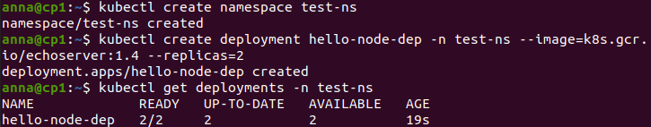
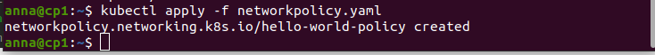
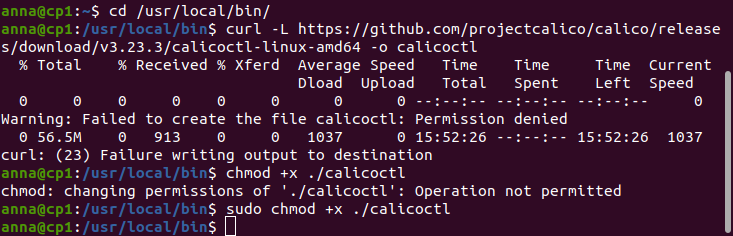
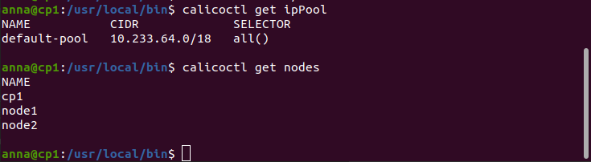
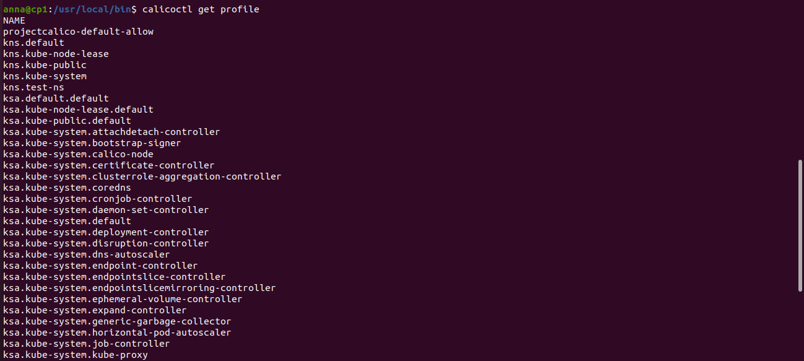
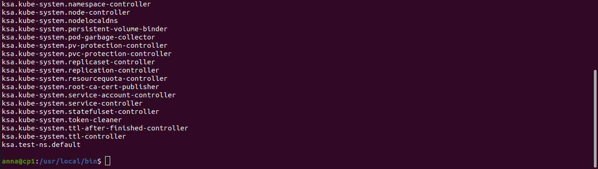

# Домашнее задание к занятию "12.5 Сетевые решения CNI"

После работы с Flannel появилась необходимость обеспечить безопасность для приложения. Для этого лучше всего подойдет Calico.

### Задание 1: установить в кластер CNI плагин Calico

Для проверки других сетевых решений стоит поставить отличный от Flannel плагин — например, Calico. Требования:

* установка производится через ansible/kubespray;
* после применения следует настроить политику доступа к hello-world извне. Инструкции kubernetes.io, Calico

## Решение:

Развернули кластер с помощью kubespray с Calico:



Создаем деплоймент
```
kubectl create namespace test-ns
kubectl create deployment hello-node-dep -n test-ns --image=k8s.gcr.io/echoserver:1.4 --replicas=2
```

Проверяем состояние деплоймента:
```
kubectl get deployments -n test-ns
```



Подготовили файл с сетевыми политиками networkpolicy.yaml

Применяем NetworkPolicy:
```
kubectl apply -f networkpolicy.yaml
```



### Задание 2: изучить, что запущено по умолчанию

Самый простой способ — проверить командой calicoctl get . Для проверки стоит получить список нод, ipPool и profile. Требования:

* установить утилиту calicoctl;
* получить 3 вышеописанных типа в консоли.

## Решение:

Установка calicoctl:
```
cd /usr/local/bin/
curl -L https://github.com/projectcalico/calico/releases/download/v3.23.3/calicoctl-linux-amd64 -o calicoctl
sudo chmod +x ./calicoctl
```



Проверка, получаем список нод, ipPool и profile:
```
calicoctl get ipPool
calicoctl get nodes
calicoctl get profile
```





