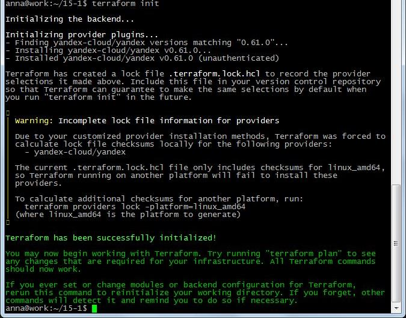
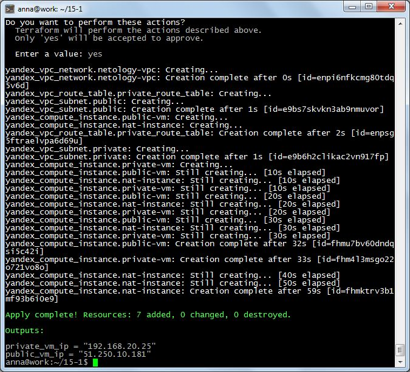
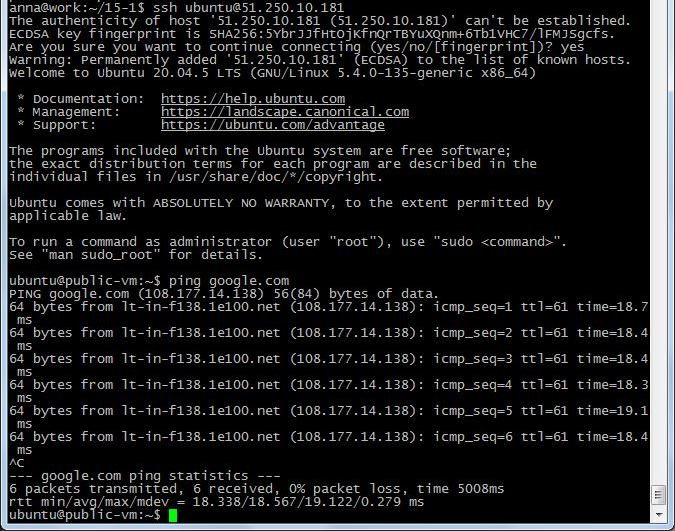
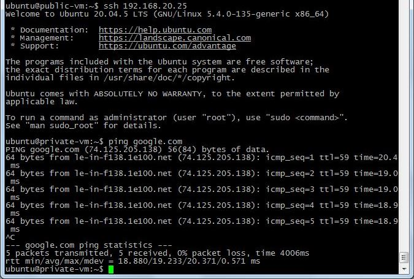

# Домашнее задание к занятию "15.1. Организация сети"

> Домашнее задание будет состоять из обязательной части, которую необходимо выполнить на провайдере Яндекс.Облако и дополнительной части в AWS по желанию. Все домашние задания в 15 блоке связаны друг с другом и в конце представляют пример законченной инфраструктуры.
> Все задания требуется выполнить с помощью Terraform, результатом выполненного домашнего задания будет код в репозитории.
> 
> Перед началом работ следует настроить доступ до облачных ресурсов из Terraform используя материалы прошлых лекций и ДЗ. А также заранее выбрать регион (в случае AWS) и зону.

### Задание 1. Яндекс.Облако (обязательное к выполнению)

1. Создать VPC.
* Создать пустую VPC. Выбрать зону.
2. Публичная подсеть.
* Создать в vpc subnet с названием public, сетью 192.168.10.0/24.
* Создать в этой подсети NAT-инстанс, присвоив ему адрес 192.168.10.254. В качестве image_id использовать fd80mrhj8fl2oe87o4e1
* Создать в этой публичной подсети виртуалку с публичным IP и подключиться к ней, убедиться что есть доступ к интернету.
3. Приватная подсеть.
* Создать в vpc subnet с названием private, сетью 192.168.20.0/24.
* Создать route table. Добавить статический маршрут, направляющий весь исходящий трафик private сети в NAT-инстанс
* Создать в этой приватной подсети виртуалку с внутренним IP, подключиться к ней через виртуалку, созданную ранее и убедиться что есть доступ к интернету

Подготовила файлы конфигурации:

[main.tf](https://github.com/anna-maksimovna/devops-netology/blob/main/15-1/terraform/main.tf)
```
terraform {
  required_providers {
    yandex = {
      source  = "yandex-cloud/yandex"
      version = "0.61.0"
    }
  }
}

provider "yandex" {
  token     = "${var.yc_token}"
  cloud_id  = "b1gukgdippc16e20ecq2"
  folder_id = "b1gtdp9f0lma03j8m6c2"
  zone      = local.zone
}

locals {
  zone           = "ru-central1-a"
  nat_gateway    = "192.168.10.254"
}

resource "yandex_vpc_network" "netology-vpc" {}

resource "yandex_vpc_subnet" "public" {
  v4_cidr_blocks = ["192.168.10.0/24"]
  zone           = local.zone
  network_id     = "${yandex_vpc_network.netology-vpc.id}"
}

resource "yandex_vpc_route_table" "private_route_table" {
  network_id = yandex_vpc_network.netology-vpc.id

  static_route {
    destination_prefix = "0.0.0.0/0"
    next_hop_address   = local.nat_gateway
  }
}

resource "yandex_vpc_subnet" "private" {
  v4_cidr_blocks = ["192.168.20.0/24"]
  zone           = local.zone
  network_id     = "${yandex_vpc_network.netology-vpc.id}"
  route_table_id = yandex_vpc_route_table.private_route_table.id
}
```


[nat.tf](https://github.com/anna-maksimovna/devops-netology/blob/main/15-1/terraform/nat.tf)
```
resource "yandex_compute_instance" "nat-instance" {
  name     = "nat-instance"
  hostname = "nat-instance"

  resources {
    cores  = 2
    memory = 2
  }

  boot_disk {
    initialize_params {
      image_id = "fd80mrhj8fl2oe87o4e1"
    }
  }

  network_interface {
    subnet_id  = yandex_vpc_subnet.public.id
    ip_address = local.nat_gateway
    nat        = true
  }

  scheduling_policy {
    preemptible = true
  }

  metadata = {
    ssh-keys = "ubuntu:${file("~/.ssh/id_rsa.pub")}"
  }
}
```

[outputs.tf](https://github.com/anna-maksimovna/devops-netology/blob/main/15-1/terraform/outputs.tf)
```
output "public_vm_ip" {
  value = yandex_compute_instance.public-vm.network_interface.0.nat_ip_address
}

output "private_vm_ip" {
  value = yandex_compute_instance.private-vm.network_interface.0.ip_address
}
```

[vm.tf](https://github.com/anna-maksimovna/devops-netology/blob/main/15-1/terraform/vm.tf)
```
data "yandex_compute_image" "ubuntu-2004" {
  family = "ubuntu-2004-lts"
}

resource "yandex_compute_instance" "public-vm" {
  name     = "public-vm"
  hostname = "public-vm"

  resources {
    cores  = 2
    memory = 2
  }

  boot_disk {
    initialize_params {
      image_id = data.yandex_compute_image.ubuntu-2004.id
    }
  }

  network_interface {
    subnet_id = yandex_vpc_subnet.public.id
    nat       = true
  }

  scheduling_policy {
    preemptible = true
  }

  metadata = {
    ssh-keys = "ubuntu:${file("~/.ssh/id_rsa.pub")}"
  }
}

resource "yandex_compute_instance" "private-vm" {
  name     = "private-vm"
  hostname = "private-vm"

  resources {
    cores  = 2
    memory = 2
  }

  boot_disk {
    initialize_params {
      image_id = data.yandex_compute_image.ubuntu-2004.id
    }
  }

  network_interface {
    subnet_id = yandex_vpc_subnet.private.id
    nat       = false
  }

  scheduling_policy {
    preemptible = true
  }

  metadata = {
    ssh-keys = "ubuntu:${file("~/.ssh/id_rsa.pub")}"
  }
}
```

[variables.tf](https://github.com/anna-maksimovna/devops-netology/blob/main/15-1/terraform/variables.tf)
```
variable "yc_token" {
    type = string
}
```

Применяем конфигурацию:
```
terraform init
```


```
terraform apply
```



Результат:






> Задание 2 не сделано (необязательное)